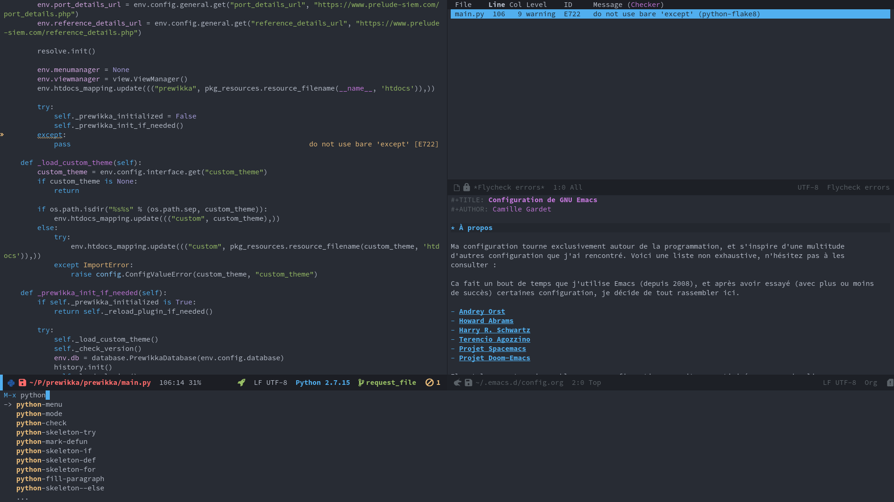

<a href="https://www.gnu.org/software/emacs/"><b>Emacs</b></a>

	
	
	
    
    

Ma configuration Emacs.

---

Fichiers principaux :
* [`config.org`](https://github.com/M3nace/.emacs.d/blob/master/config.org/):
  fichier de configuration principal
* [`init.el`](https://github.com/M3nace/.emacs.d/blob/master/init.el):
  chargement et conversion du fichier de configuration principal
